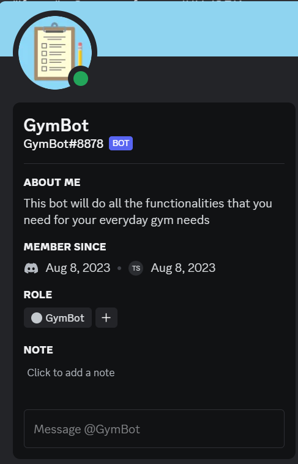
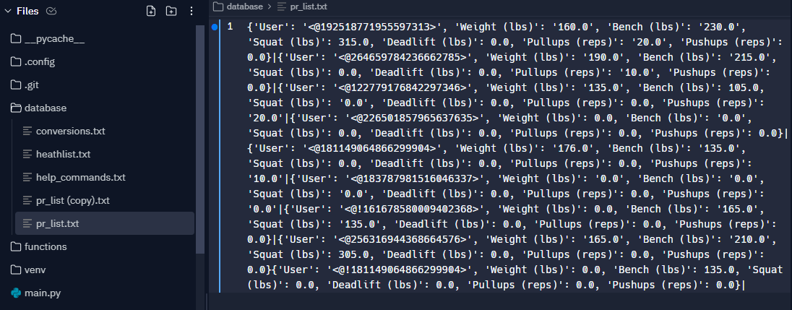
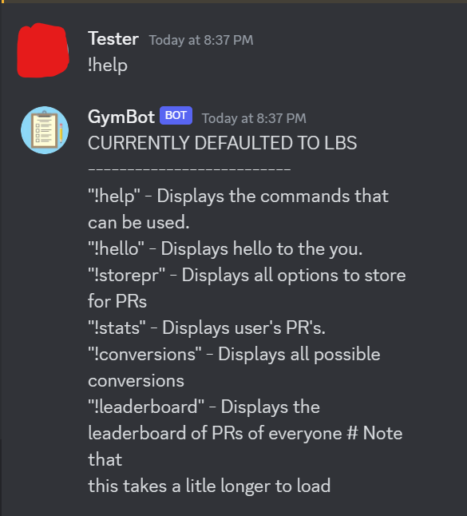
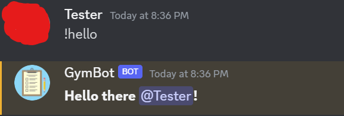
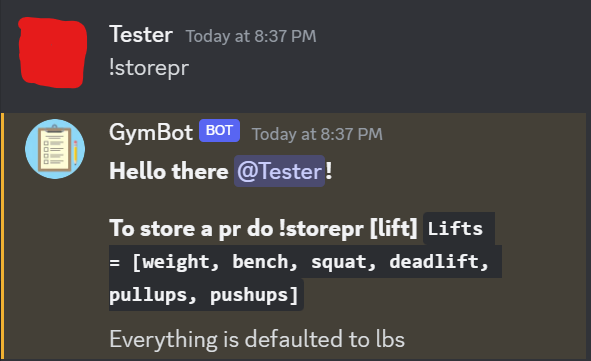
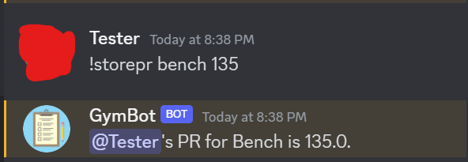
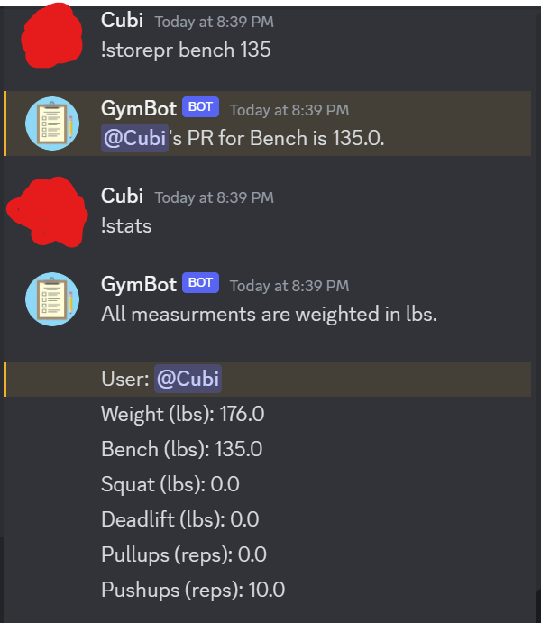
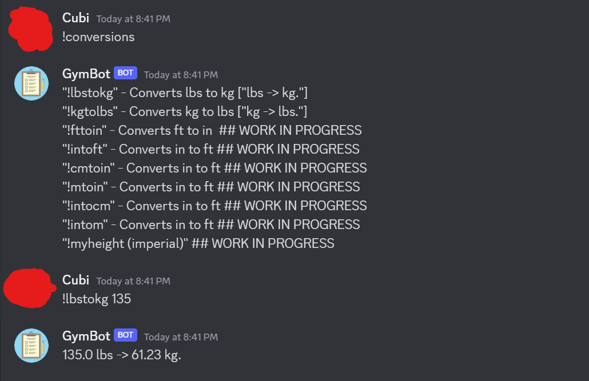
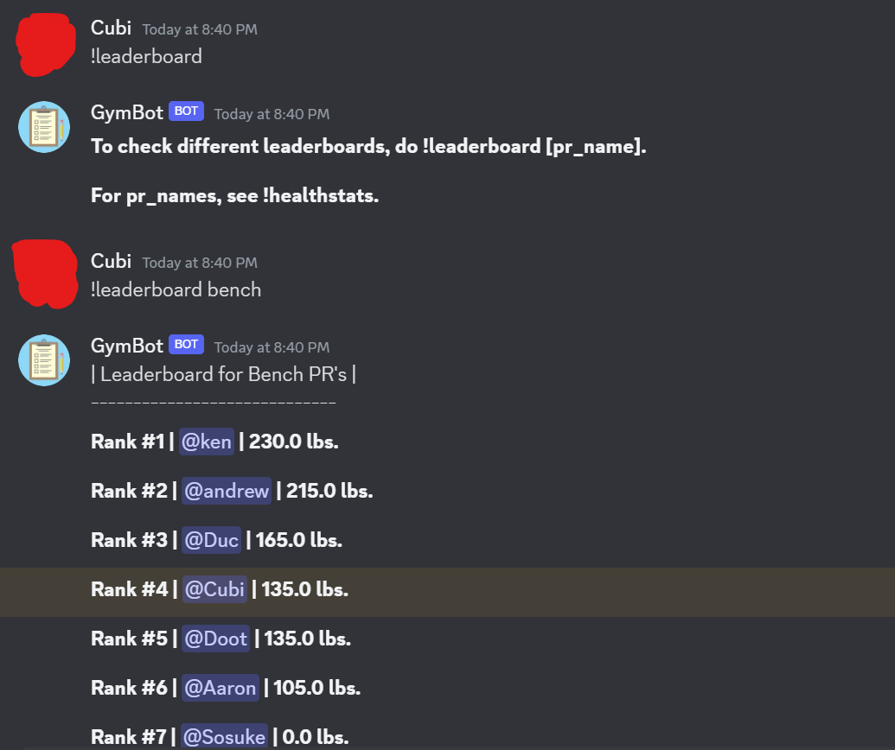

# Gym Discord Bot

---

## Table of Contents
- [Section 1: Introduction](#section-1-introduction)
- [Section 2: How It Works](#section-2-how-it-works)
  - [Database](#database)
- [Section 3: Usage](#section-3-usage)
  - [Commands](#commands)
    - [Help](#help)
    - [Hello](#hello)
    - [Storepr](#storepr)
    - [Stats](#stats)
    - [Conversions](#conversions)
    - [Leaderboard](#leaderboard)

## Section 1: Introduction

### Introduction/Inspiration
The purpose of creating this bot was that me and my friend were always like why isn't there a bot on discord that tracks your gym statistics and as gym heads and coders we decided that it was time for that to change. I did not want to use my own computer to host this bot so I found a site called repl.it that acts as a cloud drive/ide that will run, compile, and store my code. I did some more research and figured out that I can make it run 24/7 using another site called uptime.com that would monitor the website and did some research on the syntax that discord uses to code in Python. I did not really know much about storing databases so I asked a friend how I would do it and since he had taken a class where he used .txt databases he said I should just go with that. 
*Note: This is not for any professional use or anything so there are some possiblilties of bugs and not as pretty looking.*

### Section 2: How It Works

### Description
This bot utilizes python to store gym personal records and displays them on discord for you to track and see eachother on the leaderboard. So far the leaderboard is on all servers that the bot is on since the database is not on a per server basis.

`Figure 1: This is what the display would like like if the user clicked on the bot's profile.`

### Database
The database works by using a .txt file which has dictionaries stored into it and has a '|' delimiter that separates between users to know that you have reached a new user.
All this data is stored on one line so the algorithm uses function that searche that one line until it reaches the delimiter to find specified data and ',' for the data personal record type

`Figure 2: Shows the user's personal record database.`

### Section 3: Usage

### Commands
The commands are listed as followed from [help_commands.txt](database/help_commands.txt)

| Command          | Description                                         |
|------------------|-----------------------------------------------------|
| `!`              | All commands are started with a !                   |
| `!help`          | Displays the commands that can be used.             |
| `!hello`         | Displays hello to you.                              |
| `!storepr`       | Displays all options to store for Personal Records (pr).|
| `!stats`         | Displays user's PR's.                               |
| `!conversions`   | Displays all possible conversions.                  |
| `!leaderboard`   | Displays the leaderboard of PRs of everyone. Note that this takes a little longer to load. |

### Here are some outputs of how the commands would be displayed to for the user:

---

#### Help

`Figure 3: This will display all commands the bot has to offer from !help.`

---

#### Hello

`Figure 4: This will greet the user if they say !hello/hi/hey.`

---

#### Storepr

`Figure 5: !Storepr [lift] will store your pr stats into the database.`

---

#### Stats

`Figure 6: This will show your individual stats from the database if !stats is called.`

---

#### Conversions

`Figure 7: !Storepr [lift] will store your pr stats into the database.`

---

#### Leaderboard

`Figure 8: !Leaderboard displays the ranking based on everyone in the database on who is the strongest/best`

---
